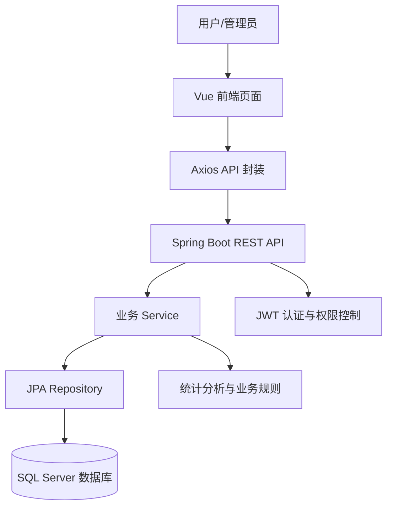
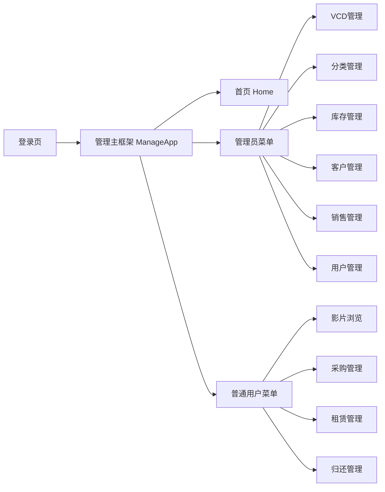
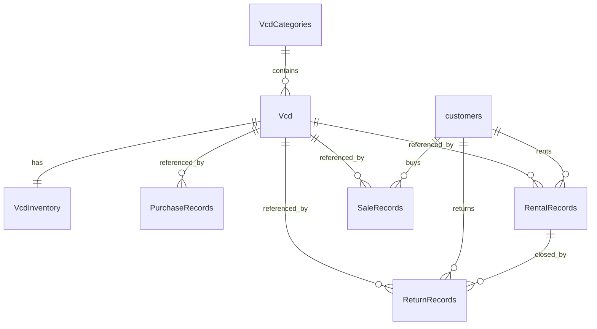

# VCD 管理系统功能架构说明

## 1. 文档目的

本文档用于描述本项目当前实现版本的功能架构，帮助在软件架构课程中撰写以下类型的报告材料：

- 系统总体设计报告
- 功能需求分析报告
- 软件架构说明书
- 模块划分与职责说明
- 业务流程分析报告
- 数据与权限设计说明

本文档聚焦"系统能做什么、由哪些模块完成、模块之间如何协作"，不以底层代码细节为主，但内容与当前项目代码实现保持一致。

---

## 2. 系统概述

### 2.1 系统名称

VCD 管理系统

### 2.2 系统定位

本系统是一个面向 VCD 经营场景的业务管理平台，围绕 VCD 的采购、入库、库存、租赁、归还、销售、客户管理和用户权限管理展开，兼顾管理端与普通用户端两类使用者。

从业务角度看，它不是单一的库存系统，也不是单一的租赁系统，而是一个将以下能力整合在一起的综合业务系统：

- VCD 资源管理
- 库存与进销存管理
- 租赁业务管理
- 归还与费用结算管理
- 客户信息管理
- 用户与权限管理
- 管理驾驶舱与统计分析

### 2.3 技术形态

系统采用前后端分离架构：

- 前端：Vue 3 + Vite + Element Plus
- 后端：Spring Boot 3 + Spring Security + JPA
- 数据库：SQL Server
- 认证方式：JWT 无状态认证

### 2.4 使用对象

系统主要面向两类角色：

1. 管理员（ADMIN）
2. 普通用户（USER）

不同角色登录后看到的菜单、页面和可执行操作不同。

---

## 3. 总体功能架构

从整体上看，系统可以分成 5 个层次：

1. 表现层  
   即前端页面和交互界面，负责展示业务数据、接收用户输入、发起操作。

2. 接口层  
   即后端 REST API，对前端提供统一的数据访问入口。

3. 业务层  
   即后端 Service 层，负责实现采购、租赁、归还、销售、统计等业务规则。

4. 数据层  
   即实体类、Repository 和数据库表，负责存储系统业务数据。

5. 安全与支撑层  
   包括登录认证、JWT 校验、角色授权、全局异常处理、跨域配置、静态资源映射等。

可用下图表示其总体结构：



---

## 4. 角色与权限架构

### 4.1 角色划分

系统定义了两个基础角色：

| 角色 | 说明 |
|------|------|
| `ADMIN` | 管理员，负责系统主数据维护、库存管理、销售管理、用户管理和经营分析 |
| `USER` | 普通用户，主要参与选片、采购、租赁、归还等业务操作 |

### 4.2 权限控制思路

系统采用"前端路由控制 + 后端接口鉴权"的双层控制方式。

1. 前端控制  
   前端在路由切换时根据 JWT 和角色判断用户是否能访问某个页面，不能访问时会被重定向到首页。

2. 后端控制  
   后端通过 Spring Security 对不同 API 设置访问规则，确保即使前端被绕过，未授权用户仍无法调用敏感接口。

### 4.3 角色能力边界

#### 管理员可执行的核心功能

- 查看管理驾驶舱与统计看板
- 管理 VCD 信息
- 管理分类信息
- 管理库存信息
- 管理客户信息
- 管理销售记录
- 管理系统用户
- 查看或维护系统基础业务数据

#### 普通用户可执行的核心功能

- 访问用户首页
- 浏览影片目录
- 新增采购记录
- 新增租赁记录
- 新增归还记录
- 查看与自己业务相关的操作界面

### 4.4 权限特征总结

该系统权限模型偏向课程项目中常见的 RBAC（基于角色的访问控制）模式，特点如下：

- 角色种类少，结构清晰
- 菜单权限与接口权限基本一致
- 普通用户可读取部分主数据，用于下拉选择和业务办理
- 管理员拥有主数据写权限和统计分析权限

---

## 5. 前端功能架构

### 5.1 前端总体结构

前端采用单页应用方式实现，登录成功后进入统一的管理壳层页面，再根据路由切换具体业务视图。

前端可分为以下几部分：

1. 登录入口
2. 管理主框架
3. 管理员功能页面
4. 普通用户功能页面
5. API 调用封装
6. 路由与角色访问控制

### 5.2 前端页面结构

```text
前端系统
├── 登录入口
│   └── login.html
├── 管理入口
│   └── manage.html
├── 管理主框架
│   └── ManageApp.vue
├── 公共能力
│   ├── router/index.js
│   ├── api/index.js
│   └── utils/role.js
└── 业务视图
    ├── HomeView.vue
    ├── VcdView.vue
    ├── CategoriesView.vue
    ├── InventoryView.vue
    ├── CustomersView.vue
    ├── SalesView.vue
    ├── UsersView.vue
    ├── UserCatalogView.vue
    ├── PurchaseView.vue
    ├── RentalView.vue
    ├── ReturnView.vue
    └── UserDashboardView.vue
```

### 5.3 前端路由架构

系统当前主要业务路由如下：

| 路由 | 页面 | 角色定位 | 功能摘要 |
|------|------|----------|----------|
| `/home` | 首页 | 管理员 / 普通用户 | 根据角色展示不同首页内容 |
| `/vcd` | VCD 管理 | 管理员 | 管理影片主数据 |
| `/categories` | 分类管理 | 管理员 | 管理影片分类 |
| `/inventory` | 库存管理 | 管理员 | 管理库存记录、查看库存状态 |
| `/customers` | 客户管理 | 管理员 | 管理客户信息、查看客户画像 |
| `/sales` | 销售管理 | 管理员 | 维护销售记录 |
| `/users` | 用户管理 | 管理员 | 维护系统用户与权限 |
| `/catalog` | 影片浏览 | 普通用户 | 浏览、筛选、查看可租影片 |
| `/purchase` | 采购管理 | 普通用户 | 新增和查看采购记录 |
| `/rental` | 租赁管理 | 普通用户 | 新增和查看租赁记录 |
| `/return` | 归还管理 | 普通用户 | 新增和查看归还记录 |

说明：

- `/home` 是统一首页，但其内部根据角色渲染两套不同视图。
- `UserDashboardView.vue` 不是独立路由，而是普通用户首页中的工作台子界面。

### 5.4 前端功能模块划分

#### 5.4.1 管理员端模块

管理员端可以分为 6 个功能子系统。

##### 1. 首页总览模块

对应页面：`HomeView.vue`

主要功能：

- 展示经营总览指标
- 展示总租赁数、VCD 总数、客户总数、逾期数量等 KPI
- 展示热门 VCD、类型分布、租赁趋势、近期租赁记录
- 作为管理员观察系统运行状况的总入口

##### 2. 影片资源管理模块

对应页面：

- `VcdView.vue`
- `CategoriesView.vue`

主要功能：

- 维护 VCD 基础信息
- 维护影片所属分类
- 支持列表查看、搜索、增加、修改、删除
- 为库存、租赁、采购、销售等业务提供主数据支撑

##### 3. 库存管理模块

对应页面：`InventoryView.vue`

主要功能：

- 维护 VCD 库存记录
- 记录总库存与已租出数量
- 计算可用库存
- 标识低库存、零库存等状态
- 为采购、租赁、销售提供库存依据

##### 4. 客户管理模块

对应页面：`CustomersView.vue`

主要功能：

- 维护客户基本资料
- 基于租赁记录和归还记录生成客户画像
- 对客户进行活跃、风险、待激活等分层
- 展示重点客户和客户行为摘要

##### 5. 销售管理模块

对应页面：`SalesView.vue`

主要功能：

- 维护销售记录
- 记录某个客户购买某个 VCD 的销售行为
- 销售发生时联动扣减库存
- 为经营统计提供销售数据基础

##### 6. 用户与权限模块

对应页面：`UsersView.vue`

主要功能：

- 查看系统用户列表
- 注册用户
- 修改用户信息
- 删除用户
- 支撑管理员对系统使用者进行管理

#### 5.4.2 普通用户端模块

普通用户端可以分为 4 个功能子系统。

##### 1. 用户首页与工作台模块

对应页面：

- `HomeView.vue`
- `UserDashboardView.vue`

主要功能：

- 展示欢迎信息和个人工作台
- 展示推荐影片、在租情况、快捷入口、即将到期租赁等信息
- 帮助普通用户快速进入常用业务功能

##### 2. 影片浏览模块

对应页面：`UserCatalogView.vue`

主要功能：

- 浏览影片目录
- 根据分类和关键词筛选影片
- 查看影片价格、库存状态和推荐信息
- 为租赁业务提供选片入口

##### 3. 采购模块

对应页面：`PurchaseView.vue`

主要功能：

- 新增采购记录
- 查看历史采购记录
- 在采购成功后推动库存增加

##### 4. 租赁与归还模块

对应页面：

- `RentalView.vue`
- `ReturnView.vue`

主要功能：

- 新增租赁记录
- 查看租赁流水
- 办理归还登记
- 记录逾期、损坏等状态
- 自动联动库存与租赁状态更新

### 5.5 前端导航关系

前端整体采用"统一壳层 + 按角色展示菜单 + 单页切换视图"的导航模式。

可概括为：



### 5.6 前端 API 资源划分

前端通过统一 API 模块访问后端，按资源分为：

| API 封装对象 | 对应资源 | 主要用途 |
|--------------|----------|----------|
| `userApi` | 用户 | 登录、注册、用户管理 |
| `categoryApi` | 分类 | 分类增删改查 |
| `vcdApi` | VCD | VCD 增删改查与搜索 |
| `inventoryApi` | 库存 | 库存查询与维护 |
| `customerApi` | 客户 | 客户查询、搜索、增删改查 |
| `purchaseApi` | 采购记录 | 采购登记与查询 |
| `rentalApi` | 租赁记录 | 租赁登记与查询 |
| `returnApi` | 归还记录 | 归还登记与查询 |
| `salesApi` | 销售记录 | 销售登记与维护 |
| `dashboardApi` | 仪表盘统计 | 管理员首页统计分析 |

---

## 6. 后端功能架构

### 6.1 后端总体结构

后端采用典型的分层式业务架构，可分为：

1. Controller 层  
   接收前端请求，对外暴露 REST 接口。

2. Service 层  
   承担核心业务逻辑，例如库存变化、租赁校验、归还联动、统计聚合等。

3. Repository 层  
   负责数据库访问。

4. Entity 层  
   定义领域对象和数据库映射关系。

5. Config / Security 层  
   负责安全、过滤器、异常处理、跨域和资源映射。

### 6.2 后端模块划分

按照业务职责，后端可以拆分为以下模块。

#### 6.2.1 用户与认证模块

相关包：

- `User`
- `util/JwtUtil`
- `config/SecurityConfig`
- `config/JwtAuthenticationFilter`

主要职责：

- 用户登录
- 用户注册
- 用户信息维护
- 生成 JWT
- 校验 JWT
- 根据角色授予接口访问权限
- 支撑内置管理员账号

#### 6.2.2 VCD 主数据模块

相关包：

- `Vcd`
- `VcdCategories`

主要职责：

- 管理 VCD 基础信息
- 管理影片分类
- 提供影片搜索、查询和关联能力
- 为库存、采购、租赁、销售等业务提供统一影片主数据

#### 6.2.3 库存模块

相关包：

- `VcdInventory`

主要职责：

- 保存每部 VCD 的库存记录
- 记录总库存和当前租出数量
- 提供库存查询与维护能力
- 在采购、租赁、归还、销售时进行库存联动

#### 6.2.4 客户模块

相关包：

- `customers`

主要职责：

- 管理客户信息
- 支撑租赁、归还、销售中的客户引用
- 为客户画像分析提供基础数据

#### 6.2.5 采购模块

相关包：

- `purchaseRecords`

主要职责：

- 记录采购入库行为
- 与库存模块联动，增加库存数量

#### 6.2.6 租赁模块

相关包：

- `RentalRecords`

主要职责：

- 记录租赁行为
- 校验库存可租数量
- 增加租出数
- 保存租赁日期、预计归还日期、押金等业务字段

#### 6.2.7 归还模块

相关包：

- `ReturnRecords`

主要职责：

- 记录归还行为
- 关联原租赁单
- 更新租赁状态
- 减少租出数
- 记录归还状态、逾期、损坏、费用等结果

#### 6.2.8 销售模块

相关包：

- `SalesRecords`

主要职责：

- 记录销售行为
- 在销售成功后扣减库存总量
- 支撑后续经营数据统计

#### 6.2.9 仪表盘统计模块

相关包：

- `Dashboard`

主要职责：

- 聚合业务数据生成首页统计结果
- 统计总租赁数、总客户数、总 VCD 数、逾期数
- 计算热门 VCD、月度趋势、分类统计、客户频率分布、近期租赁等分析数据

### 6.3 后端 REST 接口架构

后端以资源化接口方式对外提供服务，主要接口前缀如下：

| 接口前缀 | 功能说明 |
|----------|----------|
| `/api/users` | 登录、注册、用户管理 |
| `/api/vcd` | VCD 管理 |
| `/api/vcdCategories` | 分类管理 |
| `/api/vcdInventory` | 库存管理 |
| `/api/customers` | 客户管理 |
| `/api/purchaseRecords` | 采购记录管理 |
| `/api/rentalRecords` | 租赁记录管理 |
| `/api/returnRecords` | 归还记录管理 |
| `/api/salesRecords` | 销售记录管理 |
| `/api/dashboard` | 仪表盘统计 |

### 6.4 后端安全架构

后端安全设计主要包括以下内容：

1. 基于 Spring Security 的统一鉴权
2. 使用 JWT 作为登录后的身份凭证
3. 使用 BCrypt 对密码进行加密
4. 使用过滤器在每个请求中解析 JWT
5. 按角色区分管理员和普通用户的接口访问范围
6. 对前端开发端口和部署端口进行跨域放行

从架构角度看，安全模块不是孤立存在的，而是贯穿所有业务模块的横切能力。

---

## 7. 数据实体与领域模型架构

### 7.1 核心实体列表

| 实体 | 业务含义 |
|------|----------|
| `VcdCategories` | VCD 分类 |
| `Vcd` | VCD 基础信息 |
| `VcdInventory` | VCD 库存信息 |
| `customers` | 客户信息 |
| `User` | 系统用户 |
| `PurchaseRecords` | 采购记录 |
| `RentalRecords` | 租赁记录 |
| `ReturnRecords` | 归还记录 |
| `SaleRecords` | 销售记录 |

### 7.2 核心数据关系

从业务语义上看，实体之间的关系如下：



### 7.3 数据模型的架构意义

这些实体共同构成系统的业务核心，关系非常清晰：

- `Vcd` 是系统中的核心主数据
- `VcdInventory` 是围绕 `Vcd` 的库存状态实体
- `customers` 是交易行为的主体之一
- `PurchaseRecords`、`RentalRecords`、`ReturnRecords`、`SaleRecords` 是四类业务流水
- `User` 则是系统访问者，不直接参与业务单据，但决定谁能操作系统

因此，该系统可理解为：

"以 VCD 为核心对象，以库存和交易记录为主线，以客户和用户为辅助维度的业务管理系统。"

---

## 8. 核心业务功能架构

从功能实现角度，可以把系统理解为 4 条核心业务主线。

### 8.1 主线一：主数据管理

主数据管理包括：

- VCD 信息管理
- VCD 分类管理
- 客户信息管理
- 用户信息管理

它们的共同特点是：

- 主要由管理员维护
- 是其它业务模块的前置依赖
- 决定了系统中可被引用的基础对象

### 8.2 主线二：库存流转管理

库存流转是本系统最重要的业务主线之一。

库存状态受到以下操作影响：

- 采购：增加总库存
- 租赁：增加租出数
- 归还：减少租出数
- 销售：减少总库存

因此，库存模块本身虽然只有一个页面和一组表，但它实际上是采购、租赁、归还、销售四个业务模块的交汇点。

### 8.3 主线三：客户交易管理

客户交易管理包括：

- 客户租赁 VCD
- 客户归还 VCD
- 客户购买 VCD

这条主线体现了系统的业务运行过程，也为客户画像、统计分析和风险识别提供了数据来源。

### 8.4 主线四：经营分析与监控

管理员首页和部分管理页面已具备分析型功能，例如：

- 总体经营指标
- 近期业务动态
- 热门影片排行
- 分类分布
- 客户活跃情况
- 库存预警
- 客户画像

这说明本系统不仅支持事务处理，也具备一定的数据分析能力，属于"业务管理 + 简易经营分析"的混合型应用。

---

## 9. 典型业务流程架构

### 9.1 采购入库流程

```text
选择 VCD -> 填写采购信息 -> 创建采购记录 -> 更新对应库存总量 -> 前端刷新库存与采购列表
```

功能说明：

- 采购记录反映货源补充行为
- 每次采购都会推动库存增加
- 采购是库存上行的主要来源

### 9.2 租赁流程

```text
选择客户和 VCD -> 校验可用库存 -> 创建租赁记录 -> 增加租出数量 -> 标记该 VCD 有在租库存
```

功能说明：

- 租赁前必须确认库存可用
- 租赁记录创建成功后，库存的"已租出数量"增加
- 租赁是库存占用的核心来源

### 9.3 归还流程

```text
选择租赁记录 -> 填写归还信息 -> 生成归还记录 -> 更新原租赁单状态 -> 减少租出数量 -> 根据逾期/损坏情况形成归还结果
```

功能说明：

- 归还是租赁业务的闭环
- 归还记录与租赁记录存在明确关联
- 归还不仅改变库存状态，也影响客户风险标签

### 9.4 销售流程

```text
选择客户和 VCD -> 校验库存 -> 创建销售记录 -> 扣减总库存 -> 更新销售列表与库存状态
```

功能说明：

- 销售不同于租赁，不会产生归还环节
- 销售会直接减少库存总量
- 销售属于管理员端的经营业务

### 9.5 客户画像生成流程

```text
读取客户数据 + 读取租赁记录 + 读取归还记录 -> 聚合客户行为特征 -> 计算租借次数、归还次数、逾期次数 -> 生成客户分层与画像说明
```

功能说明：

- 客户画像不是独立存储的复杂模型，而是基于已有业务记录实时计算出的分析结果
- 这使得客户模块兼具"基础资料管理"和"行为分析展示"双重属性

### 9.6 首页看板生成流程

```text
聚合 VCD、客户、租赁等数据 -> 生成 DashboardDTO -> 前端首页渲染 KPI、图表和近期业务明细
```

功能说明：

- 管理首页本质上是一个聚合统计模块
- 统计数据由后端集中组织，前端负责展示和可视化

---

## 10. 模块依赖关系

从功能依赖看，系统模块之间存在明显的上下游关系。

### 10.1 基础依赖

```text
分类管理 -> VCD管理 -> 库存管理
客户管理 -> 租赁/归还/销售
用户管理 -> 登录认证 -> 系统访问
```

### 10.2 业务依赖

```text
采购 -> 库存增加
租赁 -> 库存占用
归还 -> 库存释放
销售 -> 库存扣减
租赁 + 归还 -> 客户画像
租赁 + 客户 + VCD -> 仪表盘统计
```

### 10.3 功能依赖总结

可以看出，本系统最中心的三个功能枢纽是：

1. VCD 主数据
2. 库存数据
3. 交易记录数据

其它模块大都围绕这三个核心枢纽展开。

---

## 11. 系统功能架构的特点

### 11.1 架构特点一：前后端职责分离明确

前端负责页面组织、交互和展示；后端负责业务规则、数据持久化和权限控制，分工比较清晰。

### 11.2 架构特点二：以业务对象为中心划分模块

系统没有按纯技术维度划分功能，而是按 VCD、库存、客户、采购、租赁、归还、销售等业务对象进行模块组织，符合领域驱动的基本思想。

### 11.3 架构特点三：兼顾事务处理与分析展示

系统既支持日常业务处理，又提供管理首页、库存预警、客户画像等分析型视图，使系统不只是"录入型系统"。

### 11.4 架构特点四：角色分层清晰

管理员和普通用户的页面、菜单、接口权限相对分离，降低了误操作风险，也更容易在课程报告中说明权限设计。

### 11.5 架构特点五：库存是核心联动枢纽

采购、租赁、归还、销售都会影响库存，因此库存模块是系统中最关键的业务中枢之一。

---

## 12. 适合在课程报告中重点展开的角度

如果后续需要基于本项目继续写多份课程报告，建议优先围绕下面几个角度展开，因为这些角度与当前代码实现高度一致，材料也比较充分。

### 12.1 功能需求分析

可以从以下几类需求展开：

- 用户认证需求
- 主数据管理需求
- 库存管理需求
- 租赁与归还需求
- 销售与采购需求
- 客户管理与画像需求
- 统计分析需求

### 12.2 架构设计分析

可以从以下角度展开：

- 前后端分离架构
- 分层式后端架构
- 基于角色的权限控制
- REST 接口风格设计
- 聚合统计模块设计

### 12.3 数据库与领域模型分析

可以从以下角度展开：

- 核心实体建模
- 实体关系设计
- 交易记录与主数据的关联
- 库存联动机制

### 12.4 业务流程分析

适合重点写：

- 采购入库流程
- 租赁流程
- 归还流程
- 销售流程
- 首页统计生成流程
- 客户画像生成流程

### 12.5 权限与安全分析

适合重点写：

- JWT 认证流程
- 前后端双层权限控制
- 管理员与普通用户的权限边界

---

## 13. 结论

VCD 管理系统的功能架构较为完整，已经覆盖了一个小型音像租售业务场景中的主要功能链路。其功能结构可以概括为：

- 以 VCD、客户、库存为核心资源
- 以采购、租赁、归还、销售为核心业务流程
- 以首页看板、库存预警、客户画像为核心分析能力
- 以管理员和普通用户为核心角色边界

从课程项目角度看，本系统具备以下优点：

- 功能模块完整，便于拆解分析
- 角色清晰，便于写权限设计
- 数据关系明确，便于写数据库设计
- 业务流转自然，便于写流程分析
- 前后端结构分明，便于写软件架构说明

因此，该项目非常适合作为软件架构课程中的综合型案例，用于支撑需求分析、功能架构、模块设计、权限设计、数据库设计和业务流程分析等多类报告。
